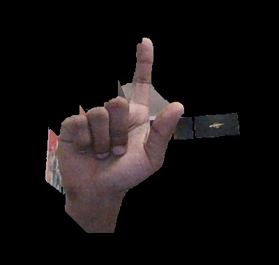

# Foreground-Detection-OpenCV
Here we can detect Foreground of images with the Help of GrabCut algorithm.

We can do a little more touchup / thresholding to make it more accurate.

you can check out the official documentation for algorithm here :
https://docs.opencv.org/master/d8/d83/tutorial_py_grabcut.html

also you can check this as well: https://youtu.be/88Ib6mC9zXE
